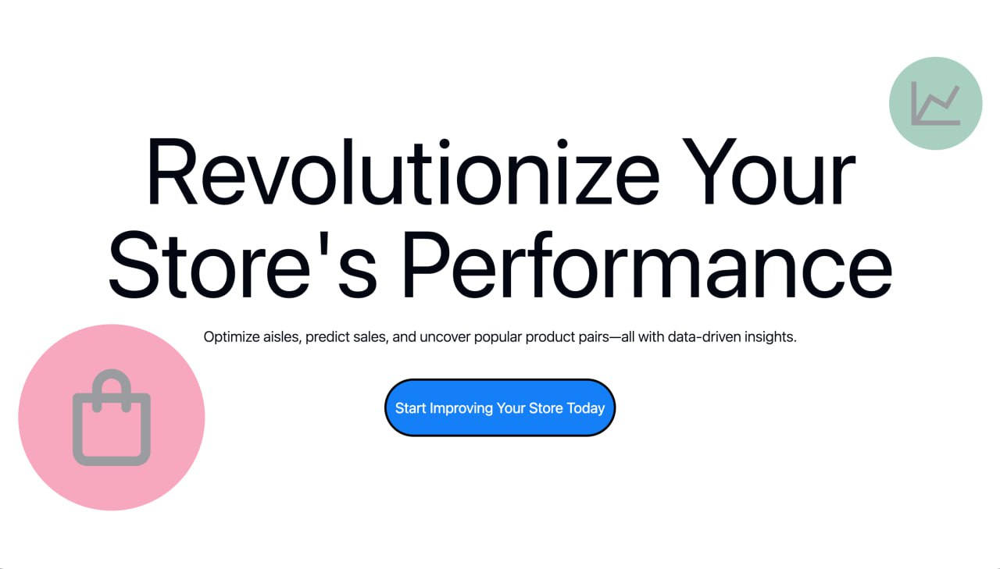
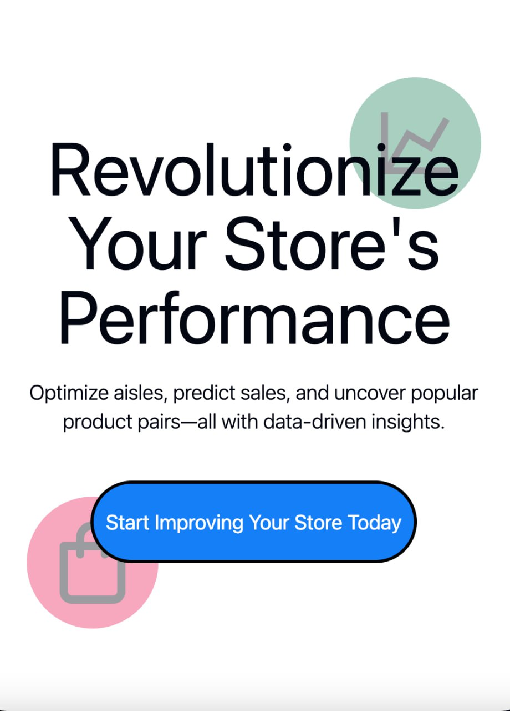
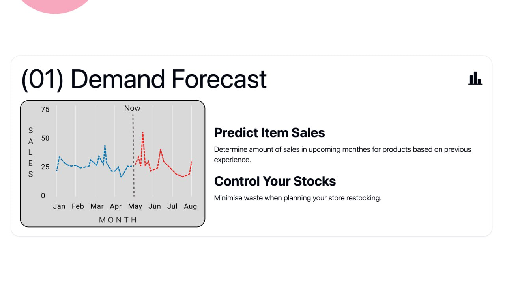
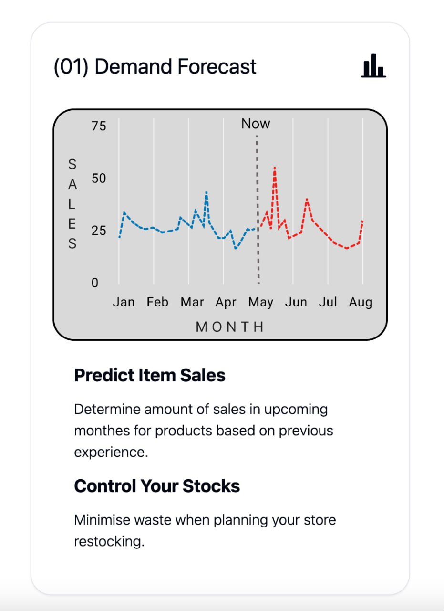
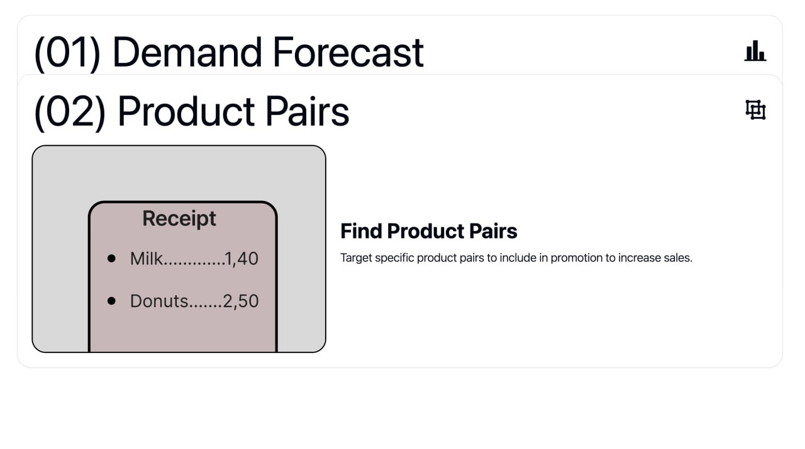
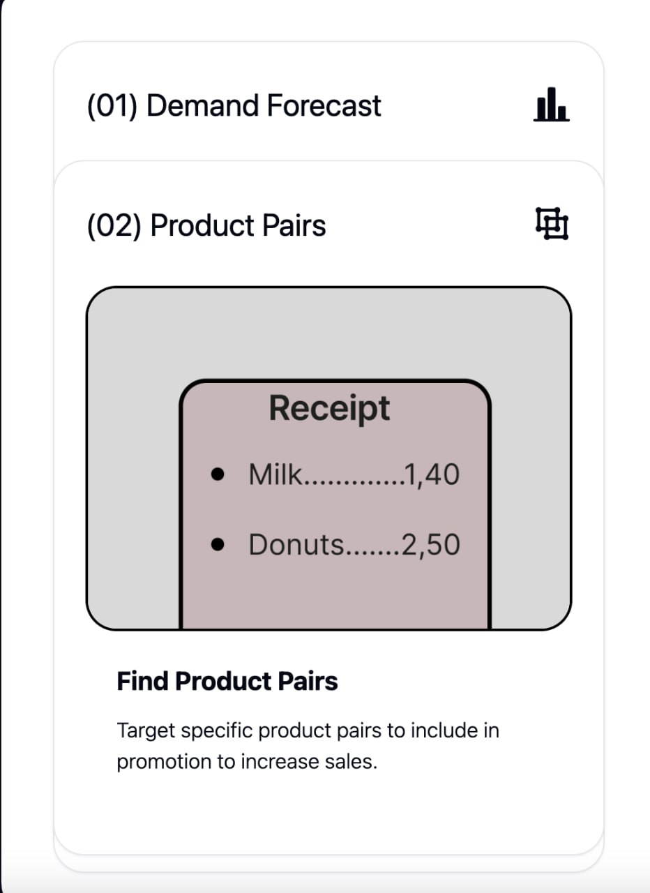
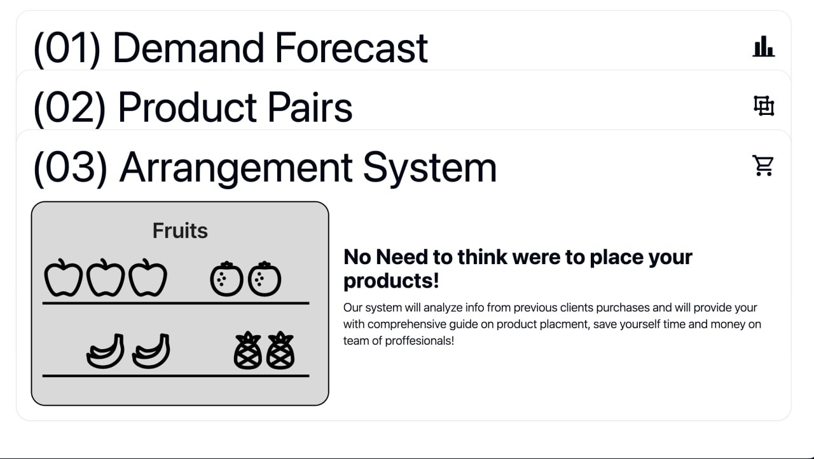
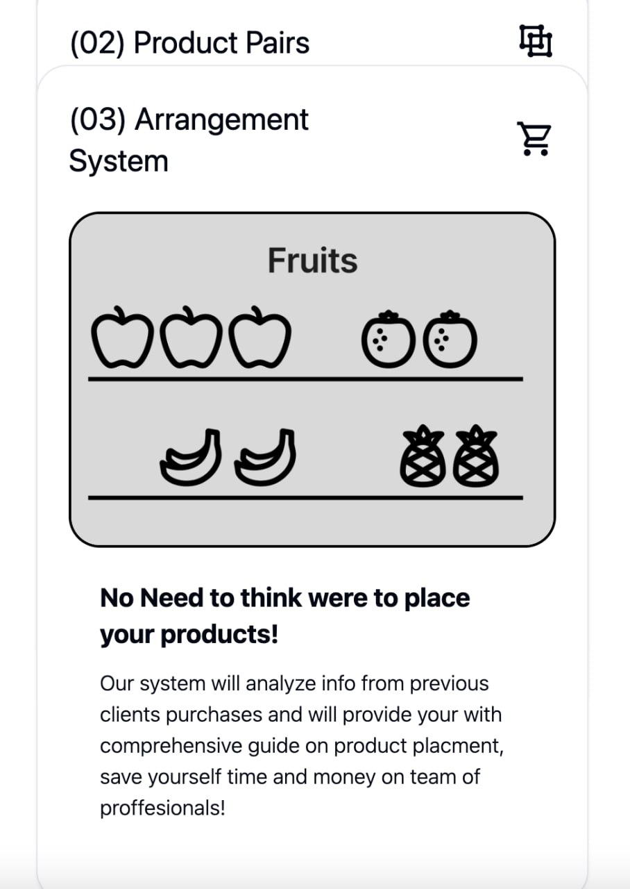

# Erste_Hackathon2024

  
  

## Overview

Our system is designed to optimize store operations by leveraging data-driven insights for inventory management, customer experience, sales optimization, and operational efficiency. By analyzing purchasing patterns and automating key tasks, our platform empowers store owners to enhance their store's performance without the need for costly consultants.

> **Note**: This entire project was developed in approximately 18 hours, showcasing the team's ability to rapidly prototype and deliver impactful solutions.

## Features

- **Demand Forecast**: Predict future sales to optimize inventory levels, reduce stockouts, and ensure popular items are always available.

  
  

- **Product Pairs**: Identify frequently bought-together items to create effective discount bundles, improve customer satisfaction, and encourage higher basket values.

  
  

- **Arrangement System**: Optimize product placement using behavioral merchandising for enhanced customer engagement and increased sales.

  
  

## Technology Stack

	<code></code>
	<code></code>
	<code></code>
	<code></code>

- **Backend**: Python
- **Frontend**: Svelte, JavaScript
- **Styling**: Tailwind CSS

## Input Data

The system accepts a set of structured datasets as input, including:

- **Organizations**: Contains store and organization details (e.g., name, address, and category).
- **Product Categories**: Maps products to their respective categories (e.g., "drinks/non-alcoholic").
- **Product Items**: Details of products purchased per receipt, including quantities.
- **Products**: Master list of all products, including price, VAT rate, and categories.
- **Receipts**: Transaction data with details like issue date, customer information, and receipts' identifiers.
- **Users**: Metadata about users of the system.

Example schemas of the datasets are included in the repository for testing and reference.

## Benefits

- Automated analysis of purchasing patterns.
- Optimized product placement and targeted discount strategies.
- Affordable, easy-to-use solution with intuitive navigation.
- Scalable model suitable for stores of all sizes.

## Pptx Presentation
Presentation is available here : [PPTX](https://github.com/BerserkChmonya/Erste_Hackathon2024/tree/main/presentation)

## Figma Board
Figma board is available here : [Figma](https://www.figma.com/design/EbbiwoaEZSHuJ8mch2TWOx/Supermarket-insights?t=JnNmF3OOyexQ6d1P-1)

## Current State

The project is in the prototype stage due to limited data and development time. With further refinement and additional data, the model will achieve higher accuracy and adaptability.

## Roadmap

1. Collect and integrate more data for improved predictions.
2. Refine the algorithms for increased accuracy.
3. Expand feature set to support more use cases.
4. Deploy the system to a broader range of store types.

